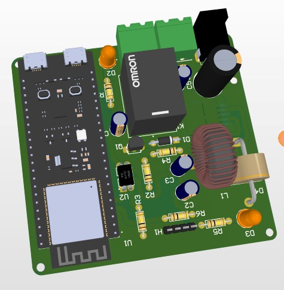
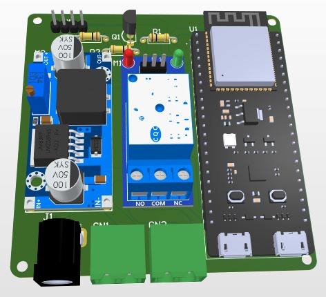
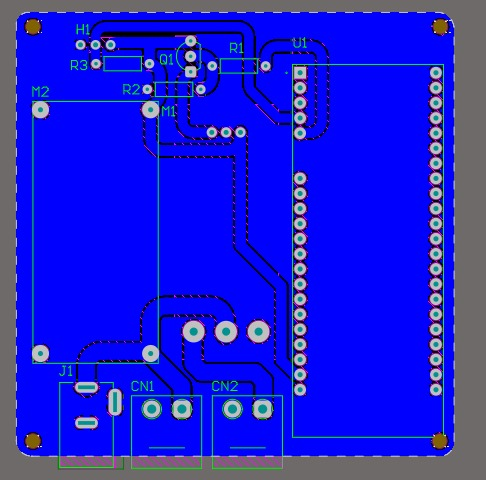
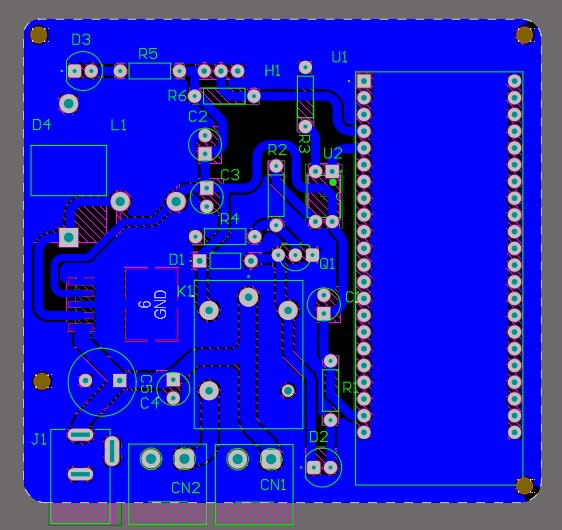

IoT-Based Water Temperature Controller
An ESP32-powered water temperature controller with a relay circuit to control a heater, designed with 12V to 5V power conversion. Two PCB versions: one using ready-made modules and another with integrated circuits, both designed in Altium.

Features
ESP32 for IoT control
Relay circuit to switch heater
12V to 5V converter for efficient power management
Single-layer PCB design
Hardware Design
🔹 Version 1: Uses relay and converter modules
🔹 Version 2: Integrated relay and power circuits

Repository Contents
Altium Design Files
Schematics & PCB Layouts
Bill of Materials (BOM)

